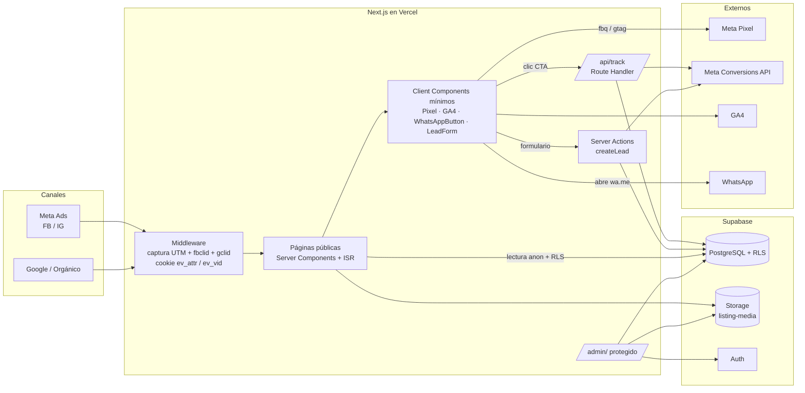
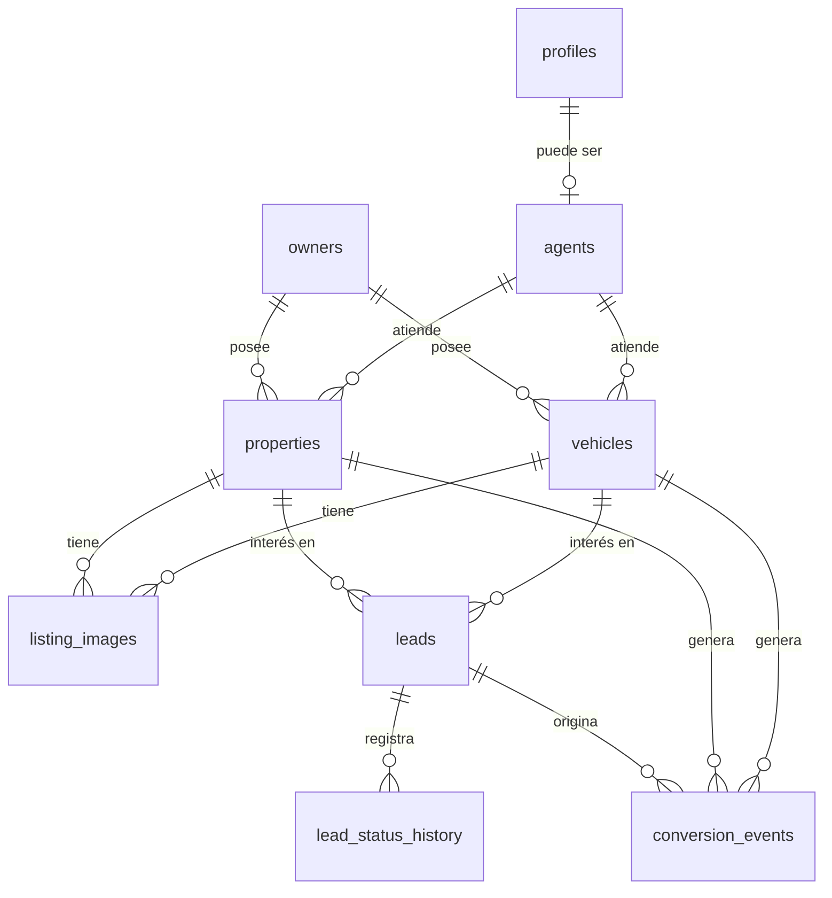

# Enfoque Visual · Arquitectura (Etapa 1)

Plataforma de captación y medición de leads de AdVibe Agencia para propiedades y vehículos.
Destino inicial: `enfoque.advibeagencia.com` en Vercel + Supabase.

> Estado: **propuesta para revisión**. No hay código de frontend todavía.
> El esquema SQL (`0001_init.sql`) se ejecutó y probó contra PostgreSQL 16 con stubs de los esquemas `auth` y `storage` de Supabase: migración, constraints, triggers, RLS por rol (anon / autenticado sin perfil / staff), cascadas y vistas. **No** se ha ejecutado aún en un proyecto Supabase real; eso ocurre en la Etapa 2.

---

## 1. Decisiones arquitectónicas clave

| # | Decisión | Por qué |
|---|----------|---------|
| 1 | **Dos tablas de catálogo (`properties`, `vehicles`)**, no una tabla genérica `listings` | Los campos, filtros y SEO son distintos. Una tabla genérica acabaría con muchas columnas nulas o con JSON sin índices. |
| 2 | **Una sola tabla `listing_images` con dos FK reales** y `CHECK (exactamente un padre)` | Integridad referencial verdadera, sin relaciones polimórficas. |
| 3 | **`leads` y `conversion_events` son cosas distintas** | Un clic a WhatsApp NO es un lead: no hay nombre ni teléfono. Es un evento anónimo atribuido. El lead nace cuando hay datos de contacto (formulario, o alta manual desde la conversación). |
| 4 | **Código de referencia en el mensaje de WhatsApp** (`Ref: EV-7K3Q9`) | Es la única forma fiable de unir «este chat» con «este clic, esta campaña, este anuncio». Sin él, la atribución de WhatsApp se pierde. Ver §8. |
| 5 | **Solo se persisten `Contact` y `Lead`** en base de datos | `PageView` y `ViewContent` tienen mucho volumen y ya viven en Pixel/GA4. Guardarlos en Postgres encarece y no aporta. |
| 6 | **Escrituras públicas solo desde el servidor** (Server Actions / Route Handlers con `service_role`) | `anon` no escribe nunca. Permite validar con Zod, honeypot y limitar tasa antes de tocar la BD. |
| 7 | **Atribución capturada en middleware y guardada en cookie propia** (`httpOnly`) | Funciona aunque el JS esté bloqueado y no obliga a que las fichas sean dinámicas. |
| 8 | **Fichas estáticas (ISR) + revalidación por etiqueta** | Máxima velocidad para tráfico de anuncios. El tracking se hace con un componente cliente pequeño. |
| 9 | **Videos por URL** (YouTube/Vimeo/etc.), no en Storage | Storage solo guarda imágenes (bucket público, 8 MB, JPEG/PNG/WebP/AVIF). Servir MP4 propios daña rendimiento y ancho de banda. |
| 10 | **Panel admin: Supabase Auth + tabla `profiles`**; sin registro público | Solo hay acceso al panel si existe una fila en `profiles`. Deshabilitar «sign ups» en Supabase Auth. |
| 11 | **Proyecto Supabase propio para Enfoque Visual** | Aísla datos, claves y cuotas de otros proyectos de la agencia. |
| 12 | **Multi-usuario preparado, no construido**: `owners`, `agents`, `profiles` con rol | Cubre «propietario distinto de la agencia» y «responsable de contacto» sin construir un CRM. |

---

## 2. Diagrama conceptual



---

## 3. Estructura de carpetas

```
enfoque-visual/
├─ supabase/
│  ├─ config.toml
│  └─ migrations/
│     └─ 0001_init.sql                  # este esquema
├─ src/
│  ├─ middleware.ts                     # captura atribución (en versiones recientes de Next puede llamarse proxy.ts: se confirma en Etapa 2)
│  ├─ app/
│  │  ├─ layout.tsx                     # fuentes, metadata base, scripts de tracking
│  │  ├─ not-found.tsx
│  │  ├─ sitemap.ts
│  │  ├─ robots.ts
│  │  ├─ (public)/
│  │  │  ├─ layout.tsx                  # header, footer, CTA WhatsApp móvil persistente
│  │  │  ├─ page.tsx                    # Home
│  │  │  ├─ propiedades/
│  │  │  │  ├─ page.tsx                 # listado + filtros (searchParams)
│  │  │  │  └─ [slug]/page.tsx          # ficha (ISR)
│  │  │  ├─ alquiler/page.tsx           # reutiliza el listado con operación fija
│  │  │  ├─ vehiculos/
│  │  │  │  ├─ page.tsx
│  │  │  │  └─ [slug]/page.tsx
│  │  │  └─ contacto/page.tsx
│  │  ├─ (admin)/admin/
│  │  │  ├─ layout.tsx                  # guard: sesión + is_staff (verificación en servidor)
│  │  │  ├─ login/page.tsx
│  │  │  ├─ propiedades/  vehiculos/  leads/
│  │  └─ api/
│  │     └─ track/route.ts              # relay a Conversions API + registro en conversion_events
│  ├─ features/                         # lógica por dominio
│  │  ├─ properties/   { queries.ts, filters.ts, schema.ts, seo.ts, components/ }
│  │  ├─ vehicles/     { queries.ts, filters.ts, schema.ts, seo.ts, components/ }
│  │  ├─ leads/        { actions.ts, schema.ts, components/LeadForm.tsx }
│  │  ├─ whatsapp/     { buildLink.ts, refCode.ts, WhatsAppButton.tsx }
│  │  └─ tracking/
│  │     ├─ client/    { MetaPixel.tsx, GoogleAnalytics.tsx, track.ts, TrackViewContent.tsx }
│  │     ├─ server/    { capi.ts, hash.ts, attribution.ts }   # 'server-only'
│  │     └─ events.ts                   # tipos y mapeo de parámetros (una sola fuente de verdad)
│  ├─ components/
│  │  ├─ ui/           # Button, Badge, Gallery, PriceTag...
│  │  └─ layout/       # Header, Footer, StickyCta
│  ├─ lib/
│  │  ├─ supabase/     { server.ts, client.ts, admin.ts('server-only') }
│  │  ├─ env.ts        # validación de variables de entorno al arrancar
│  │  ├─ format.ts  slug.ts  seo.ts
│  └─ types/database.ts                 # generado con `supabase gen types`
├─ .env.example
└─ next.config.ts                       # remotePatterns de Supabase Storage
```

Reglas: `app/` solo ensambla; la lógica vive en `features/`. Todo lo que toca secretos importa `server-only`.

---

## 4. Modelo de datos



Notas de diseño:

- **Estado en dos ejes.** `publication_status` (`borrador`/`publicado`/`archivado`) controla visibilidad; `availability` (`disponible`/`reservado`/`vendido`/`alquilado`) controla la etiqueta. Un inmueble vendido puede seguir visible como prueba social, o archivarse.
- **`on delete`**: el propietario está en `restrict` (no se borra un dueño con publicaciones). Si se borra una propiedad, los leads y eventos **se conservan** (`set null`) porque son datos de negocio y de medición.
- **Precio de alquiler** = canon mensual (convención documentada en el SQL).
- **Baños** son `numeric(3,1)` para admitir medios baños (2.5).
- **Ubicación**: `latitude`/`longitude` con validación de rango y par obligatorio; `show_exact_location` (por defecto `false`) permite mostrar solo el sector cuando el dueño no quiere exponer la dirección. PostGIS se puede añadir después si se requieren búsquedas por radio.
- **Portada**: `cover_path` está denormalizado en cada publicación y lo mantiene un trigger desde `listing_images`. Evita un join por cada tarjeta del listado.
- **Búsqueda**: columna `search_tsv` generada con configuración `spanish` + índice GIN, para un buscador de texto libre si se decide añadir.
- **Índices parciales** (`where publication_status = 'publicado'`): el público solo consulta lo publicado, así los índices son pequeños y rápidos.
- **Añadidos que no pediste** (fáciles de quitar): `vehicles.city/province/condition`, `properties.address_line/show_exact_location`, `lead_status_history`, `owner_kind`, `deal_value` en leads.
- **Marcas y modelos** de vehículos son texto libre por ahora. El riesgo es «Mini» vs «MINI». Si aparece, la solución es una tabla `vehicle_brands` o normalizar en el panel.

### Estados del lead y embudo

`nuevo → contactado → calificado → visita_agendada → negociacion → cerrado` (o `descartado`).
Cada cambio queda en `lead_status_history` (con quién lo hizo). De ahí salen las vistas:

- `v_campaign_funnel`: campaña → publicación → leads → cuántos llegaron a cada etapa.
- `v_campaign_contacts`: campaña → publicación → clics a WhatsApp y formularios.

---

## 5. Seguridad: RLS y Storage

**RLS activado en todas las tablas, deny-by-default.**

| Tabla | `anon` | Staff autenticado | Escritura pública |
|-------|--------|-------------------|-------------------|
| `properties`, `vehicles` | Solo `publicado` | CRUD | No |
| `listing_images` | Solo de publicaciones publicadas | CRUD | No |
| `agents` | Solo `is_active` | CRUD | No |
| `owners`, `leads`, `lead_status_history`, `conversion_events` | Sin acceso | Ver / gestionar | Solo servidor (`service_role`) |
| `profiles` | Sin acceso | Ve el suyo; admin gestiona todos | No |

- **Staff** = existe fila en `profiles`. `is_staff()` / `is_admin()` son `security definer` con `search_path` vacío.
- Además de las policies, se revoca todo a `anon` y se le concede solo `SELECT` sobre las cuatro tablas públicas (defensa en profundidad). Los privilegios por defecto de Supabase vuelven a conceder permisos en tablas nuevas, así que ese bloque debe repetirse en cada migración que cree tablas.
- Las vistas usan `security_invoker`, por lo que respetan RLS.
- **Storage**: bucket `listing-media` público para lectura; solo staff sube, actualiza o borra. Ruta: `properties/{id}/{uuid}.webp` y `vehicles/{id}/{uuid}.webp`.
- **Panel**: no confiar solo en el middleware. Se verifica sesión y `is_staff` en el layout del servidor y dentro de cada Server Action / Route Handler. Mantener Next.js parcheado (hubo un bypass de autorización en middleware, CVE-2025-29927, corregido en versiones posteriores).
- Formularios: validación con Zod en servidor, campo honeypot, límites de longitud (ya también en la BD) y limitación de tasa (regla en Vercel Firewall). Sin librerías extra de sanitización: React escapa el contenido y no se renderiza HTML arbitrario.
- Privacidad: pantalla/aviso de consentimiento y política de datos personales antes de activar Pixel/GA4 en producción. `privacy_accepted_at` queda registrado en el lead. Conviene revisarlo con quien lleve lo legal (LOPDP en Ecuador).

---

## 6. Variables de entorno

```bash
# Sitio
NEXT_PUBLIC_SITE_URL=                 # ej. https://enfoque.advibeagencia.com (canonical, OG, sitemap)

# Supabase
NEXT_PUBLIC_SUPABASE_URL=
NEXT_PUBLIC_SUPABASE_ANON_KEY=        # clave pública; TODO: Supabase está migrando a "publishable/secret keys", usaremos los nombres que emita tu proyecto
SUPABASE_SERVICE_ROLE_KEY=            # SOLO servidor. Nunca NEXT_PUBLIC_

# WhatsApp (el número es público por naturaleza: aparece en el enlace wa.me)
NEXT_PUBLIC_WHATSAPP_NUMBER=          # solo dígitos con código de país, sin +
NEXT_PUBLIC_WHATSAPP_INCLUDE_REF=true # añade "Ref: EV-XXXXX" al mensaje

# Meta
NEXT_PUBLIC_META_PIXEL_ID=
META_ACCESS_TOKEN=                    # SOLO servidor
META_GRAPH_API_VERSION=               # TODO: fijar la versión vigente al implementar la Etapa 9
META_TEST_EVENT_CODE=                 # opcional, solo staging (Test Events)

# Google
NEXT_PUBLIC_GA_ID=
```

`lib/env.ts` validará que las variables `META_*` y `SUPABASE_SERVICE_ROLE_KEY` nunca lleguen al bundle del cliente.

---

## 7. Dependencias

**Producción**

| Paquete | Motivo |
|---------|--------|
| `next`, `react`, `react-dom` | Base (Next 14+; se fija la versión estable en Etapa 2) |
| `@supabase/supabase-js`, `@supabase/ssr` | Cliente y sesiones en Server Components / middleware |
| `zod` | Validación server-side de formularios, filtros y payloads de tracking |
| `lucide-react` | Iconos |
| `server-only` | Evita importar código con secretos en el cliente (paquete minúsculo) |

**Desarrollo**: `typescript`, `tailwindcss` (+ `postcss`/`autoprefixer` según versión), `eslint`, `eslint-config-next`, Supabase CLI (migraciones y `gen types`).

**Deliberadamente NO se usan**: librerías de estado, de formularios, UI kits, animación, GTM, `@next/third-parties`. Pixel y GA4 se cargan con `next/script`.

Nota de versiones: desde Next 15 `params` y `searchParams` son asíncronos y los valores por defecto de caché cambiaron. Lo definimos al fijar versión en la Etapa 2.

---

## 8. Estrategia Meta Pixel + Conversions API

**Principio:** cada evento importante se envía **dos veces con el mismo `event_id`** (navegador y servidor). Meta deduplica por `event_name` + `event_id`.

| Evento | Navegador (Pixel) | Servidor (CAPI) | Guardado en BD |
|--------|-------------------|-----------------|----------------|
| `PageView` | Sí (incluye navegación cliente en App Router) | No (volumen) | No |
| `ViewContent` | Sí | Opcional, con flag (Etapa 9) | No |
| `Contact` (clic WhatsApp) | Sí | **Sí** | `conversion_events` |
| `Lead` (formulario) | Sí | **Sí**, con email/teléfono hasheados | `leads` + `conversion_events` |

**Parámetros**

- Propiedad, `ViewContent`: `content_id`, `content_type`, `content_name`, `value`, `currency`, `city`, `operation_type`, `property_type`.
- Vehículo, `ViewContent`: `content_id`, `content_type`, `content_name`, `value`, `currency`, `vehicle_brand`, `vehicle_model`, `vehicle_year`.
- `Contact` / `Lead`: `content_id`, `content_type`, `value`, `currency`, `city`, `source` (ubicación del CTA: `ficha`, `sticky_mobile`, `card`, `form`).
- `content_type`: propongo `home_listing` y `vehicle`, que son los tipos de catálogo de Meta para inmuebles y vehículos. **TODO:** confirmar en la documentación vigente antes de implementar; ayuda si más adelante conectas un catálogo.

**Servidor (`/api/track` y Server Actions)**

- El token vive solo en el servidor. El cliente nunca llama a Meta con el token.
- Datos de coincidencia: `fbp`/`fbc` (de cookies; `fbc` se reconstruye desde `fbclid` si no existe la cookie), `client_ip_address` y `client_user_agent` (de la petición, no se guardan), `em`/`ph` en SHA-256 tras normalizar. `action_source: "website"` y `event_source_url`.
- El resultado se registra en `conversion_events.capi_status` (`pendiente`/`enviado`/`fallido`/`omitido`) con intentos y último error: un fallo de Meta no pierde el lead y se puede reintentar.
- Eventos posteriores (calificado, visita, cierre) podrán enviarse desde el CRM usando el `fbp`/`fbc`/contacto guardados en el lead. Meta tiene requisitos específicos para optimizar con eventos de CRM; **TODO** revisarlos en la Etapa 9.

**Decisión pendiente sobre `value`.** Si en `Contact`/`Lead` envías el precio de la propiedad como `value`, Meta interpretará que cada lead vale, por ejemplo, $190.000, y esto distorsiona la optimización por valor y el ROAS. Mi recomendación: enviar el precio como parámetro personalizado `listing_price` y usar en `value` un valor de lead fijo o ninguno. Para `ViewContent` sí tiene sentido el precio. Por defecto seguiré tu especificación (precio en `value`) hasta que decidas.

---

## 9. Estrategia de atribución UTM

1. **Middleware**: si la URL trae `utm_*`, `fbclid` o `gclid`, guarda una cookie `ev_attr` (`httpOnly`, `secure`, `sameSite=lax`) con:
   - `first_touch` (solo se escribe si no existía)
   - `last_touch` (se actualiza con cada visita que traiga parámetros)
   - más `landing_url` y `referrer`
2. Cookie `ev_vid` (UUID de visitante) para unir eventos anónimos con un lead posterior.
3. Vigencia: propongo 30 días. **TODO** decidir. El middleware sale rápido si no hay parámetros y la cookie ya existe, para no penalizar el rendimiento.
4. Las fichas son estáticas, así que **no leen la cookie en el render**. Solo la leen `/api/track` y las Server Actions.
5. En el lead se copia el **last-touch** en columnas planas (es lo que acredita el anunciante) y el **first-touch** en JSON.

Convención de UTM para tus campañas (para que `v_campaign_funnel` sea legible):

```
utm_source=facebook | instagram | google
utm_medium=paid_social | cpc | organic
utm_campaign=casa_gualaceo            # una campaña por publicación o por objetivo
utm_content=video_01                  # creativo
```

---

## 10. Flujo completo: del anuncio al cierre

| Paso | Qué ocurre | Qué dato queda | Dónde |
|------|------------|----------------|-------|
| 1. **Meta Ad** | Clic con `utm_*` y `fbclid` | — | URL |
| 2. **Llegada a la ficha** | Middleware fija `ev_attr` y `ev_vid`. El Pixel crea `_fbp`/`_fbc`. La ficha se sirve estática | first/last touch | Cookies |
| 3. **ViewContent** | `<TrackViewContent>` dispara `fbq` + GA4 | Evento en Meta/GA4 | Externo |
| 4a. **Clic a WhatsApp** | El botón ya trae el mensaje con `Ref: EV-7K3Q9`. Al clic: `fbq('Contact')` con `eventID` y `POST /api/track` | `conversion_events` (Contact, ref, campaña, publicación) y CAPI | BD + Meta |
| 4b. **Formulario** | Server Action valida, crea el lead y envía `Lead` a CAPI | `leads` con atribución completa | BD + Meta |
| 5. **Lead** | Si vino de WhatsApp, el asesor crea el lead desde el panel y pega el `Ref`: se copia la atribución del evento. Nace en `nuevo` | Lead vinculado a campaña y publicación | BD |
| 6. **Lead calificado** | Estado → `calificado` | Fila en `lead_status_history` | BD |
| 7. **Visita** | Estado → `visita_agendada` | Historial | BD |
| 8. **Negociación** | Estado → `negociacion` | Historial | BD |
| 9. **Cierre** | Estado → `cerrado`, se registra `deal_value` | Historial + valor | BD |
| 10. **Lectura** | `v_campaign_funnel` responde: campaña → publicación → leads → resultado | — | Vista |

Mensaje de WhatsApp de ejemplo (texto pedido + referencia):

```
Hola, estoy interesado en la Casa en Gualaceo de $190.000 que vi en Enfoque Visual. (Ref: EV-7K3Q9)
```

El código lo genera el cliente al montar el botón (base32 sin caracteres ambiguos, 5 caracteres). `conversion_events.ref_code` es único; una colisión es improbable y el servidor la ignora.

**Nota:** si tus anuncios son de tipo *Click-to-WhatsApp* (Meta abre el chat directamente, sin pasar por la web), el flujo cambia: la atribución llega por la API de WhatsApp Business y no por la web. Eso sería una etapa adicional.

---

## 11. Renderizado y rendimiento

| Ruta | Estrategia |
|------|------------|
| `/`, fichas | Estáticas con ISR (`revalidate` + `revalidateTag` al guardar en el panel). `generateStaticParams` para las publicadas |
| `/propiedades`, `/vehiculos`, `/alquiler` | Dinámicas (usan `searchParams`), con consultas indexadas. Los filtros son un `<form method="get">` que funciona sin JS |
| `/admin/*` | Dinámicas, sin caché |
| Imágenes | `next/image` con `remotePatterns` de Supabase; portada con `priority` solo en la primera imagen visible; `width`/`height` guardados para evitar CLS |
| Scripts | Pixel y GA4 con `next/script` `afterInteractive`; sin librerías de animación |

SEO: `/alquiler` es la URL canónica de los alquileres; `/propiedades?operacion=alquiler` apunta a ella con `rel=canonical`.

---

## 12. Supuestos y pendientes (TODO)

- [ ] Confirmar la política de `value` en `Contact`/`Lead` (§8).
- [ ] Confirmar el uso del `Ref` en el mensaje de WhatsApp (§10).
- [ ] Decidir vigencia de cookies de atribución (§9).
- [ ] Definir si Enfoque Visual tendrá un proyecto Supabase propio (recomendado).
- [ ] Definir proveedor de video (YouTube, Vimeo u otro) por la política de CSP.
- [ ] Versión de Next.js y de Graph API a fijar.
- [ ] Texto de consentimiento y política de privacidad.
- [ ] Ningún dato de propiedades, vehículos, propietarios ni números reales está inventado: el esquema no incluye *seed*.